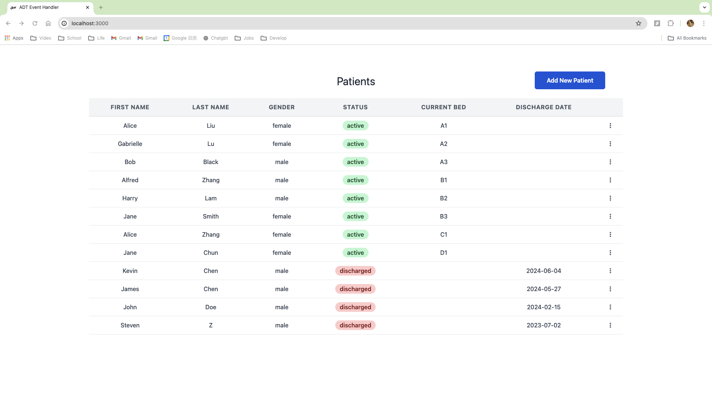
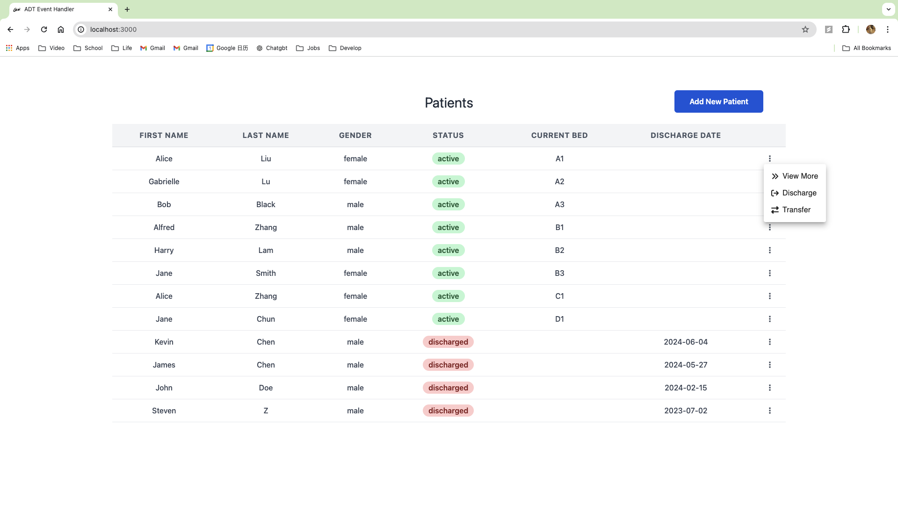
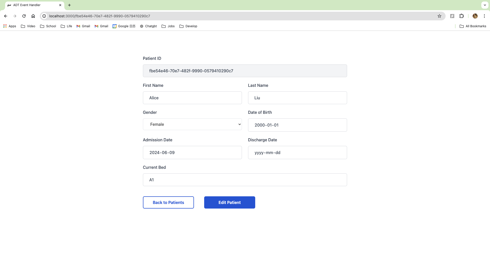
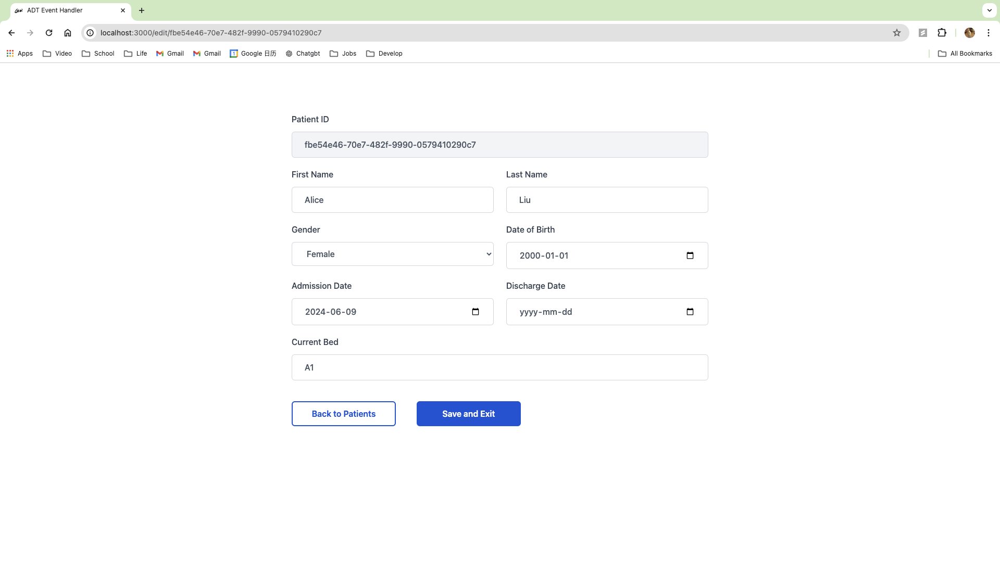
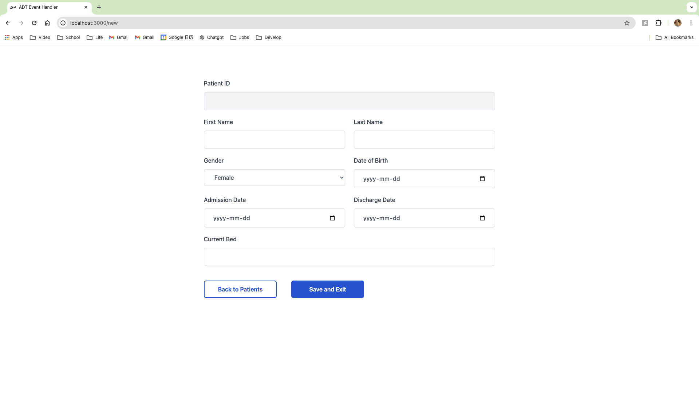
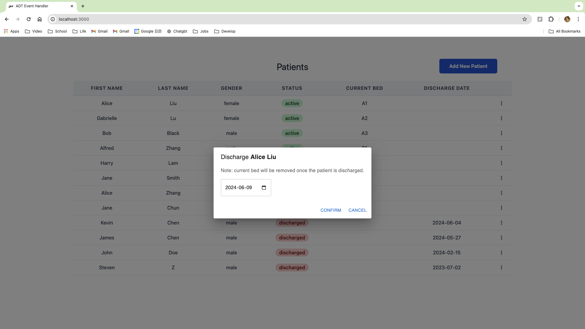
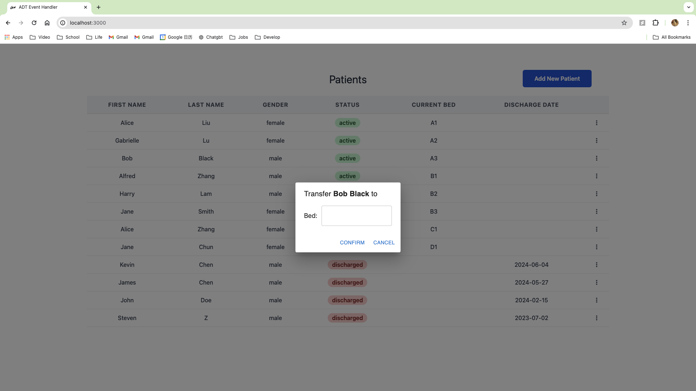
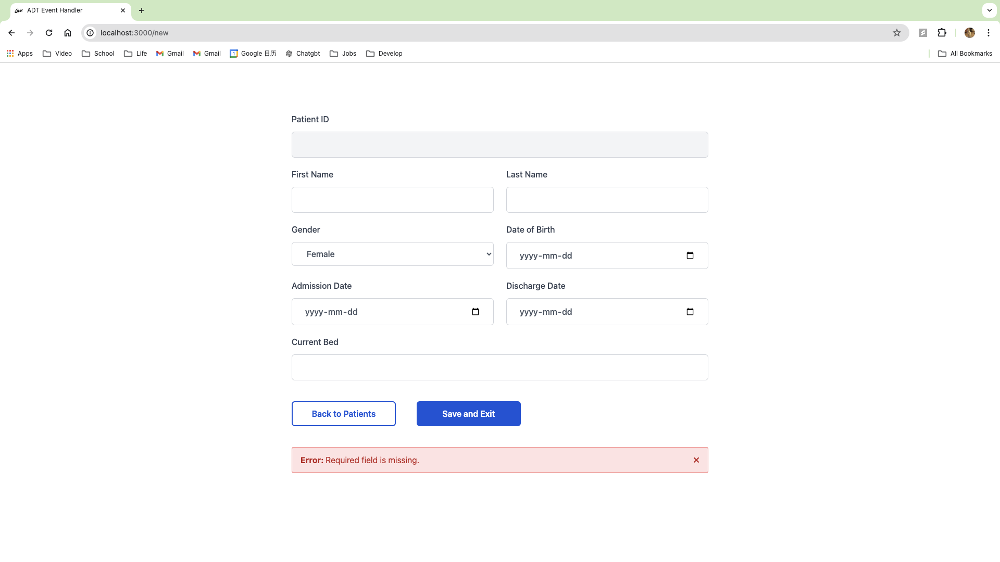

# ADT-event-handler

## About The Project

#### This system will simulate a healthcare system where a user can view/add/edit/discharge/transfer patients. The frontend is built with React and the backend is built with Express and Node.js. To preserve data, a JSON file is used.


## Setup instructions
```
git clone https://github.com/GabrielleGaiGai/ADT-event-handler.git
cd ADT-event-handler
npm install
cd frontend && npm install
cd ../backend && npm install
cd ../
npm start
```

## Event handler

### View Patient List
#### The user can view all the patients with attributes: "First Name", "Last Name", "Gender", "Status", "Current Bed", "Discharge Date".


#### To view more attributes, click the three dots button => "View More"

#### Then the user will navigate to the patient page, and see all the attributes of the corresponding patient.


### Edit Patient
#### After the user navigates to the patient page, click "Edit Patient". Then the user can edit all the attributes except "patient ID", to save the result, click "Save and Exit".


### Add Patient
#### In the patient list page, click "Add New Patient". Then the user will navigate to the new patient page where the user can add patient info and save. Please note that the patient ID will be automatically generated by backend, thus this field is disabled.


### Discharge Patient
#### There are two ways to discharge a patient:
1. The user edits "Discharge Date" and remove "Current Bed" in Edit Patient page.
2. The user clicks the three dots button => "Discharge".


### Transfer Patient
#### There are two ways to transfer a patient:
1. The user edits "Current Bed" in Edit Patient page.
2. The user clicks the three dots button => "Transfer".


## Error handler
This simulator covers the following error cases:
- [x] empty patient ID/First Name/Last Name/Date of Birth/Gender/Admission Date
- [x] duplicate patient ID/current bed
- [x] invalid patient attributes:
    - [x] non-string values for first name / last name
    - [x] Date of Birth > today
    - [x] Admission Date > today
    - [x] Discharge Date > today
    - [x] Admission Date > Discharge Date 
    - [x] Date of Birth > Admission Date 
    - [x] a patient is active without current bed
    - [x] a patient is discharged with current bed
- [x] attempt to discharge/transfer a patient who does not exist.
- [x] attempt to discharge/transfer a patient who is already discharged.

#### If any of the above error cases happens, the UI will display an error message.

#### Furthermore, to prevent the user discharge/transfer a discharged(inactive) patient, the "Discharge"/"Transfer" buttons are disabled.


## Built With
![React][ReactUrl]
![Node][NodeUrl]
![Express][ExpressUrl]
![Redux][ReduxUrl]
![MUI][MUIUrl]

[ReactUrl]: https://img.shields.io/badge/React-20232A?style=for-the-badge&logo=react&logoColor=61DAFB
[NodeUrl]: https://img.shields.io/badge/Node.js-43853D?style=for-the-badge&logo=node.js&logoColor=white
[ExpressUrl]: https://img.shields.io/badge/Express.js-404D59?style=for-the-badge
[ReduxUrl]: https://img.shields.io/badge/Redux-593D88?style=for-the-badge&logo=redux&logoColor=white
[MUIUrl]: https://img.shields.io/badge/Material--UI-0081CB?style=for-the-badge&logo=material-ui&logoColor=white

